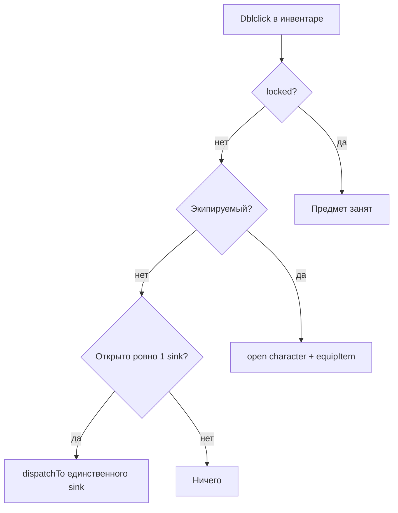

# UI хранилищ и маршрутизация предметов

Документ описывает, как клиент взаимодействует с единым storage API и как инвентарь передаёт предметы в окна игры.

Связанные файлы:

- Backend: [`app/Services/StorageMoveService.php`](../app/Services/StorageMoveService.php), [`app/Services/StorageLayoutService.php`](../app/Services/StorageLayoutService.php)
- Frontend: [`public/js/game/game.bundle.js`](../public/js/game/game.bundle.js) (`StorageManager`, `DragEngine`, `ItemDispatcher`, `StorageQuickActions`)
- Разметка: [`resources/views/layouts/game.blade.php`](../resources/views/layouts/game.blade.php), [`resources/views/partials/workbench.blade.php`](../resources/views/partials/workbench.blade.php)

---

## Единый принцип: слот → слот

Любое перемещение предмета или стака ресурса — одна операция:

```
POST /api/storage/{characterUuid}/move
{ "from_slot_uuid": "...", "to_slot_uuid": "...", "quantity": 5 }
```

Ячейка (`from` / `to`) может быть:

| `kind` в API | Таблица | Пример |
|--------------|---------|--------|
| `regular` | `slots` | инвентарь, экипировка |
| `temporary` | `temporary_slots` | обмен, верстак (overlay) |

Инвентарь **не знает**, в какое окно «целится» игрок, кроме сценариев dispatch (dblclick / ПКМ). При drag-and-drop инвентарь знает только UUID исходного и целевого слота.

---

## Overlay-модель (`temporary_slot_uuid`)

Для **обмена** и **верстака** предмет физически остаётся в инвентаре:

- `slot_uuid` — ячейка инвентаря (не меняется при overlay)
- `temporary_slot_uuid` — ячейка в пуле `temporary_slots` окна

### Флаг `locked` в layout API

| Контекст отображения | `locked` | Смысл |
|---------------------|----------|-------|
| Инвентарь / экипировка (`formatRegularStorage`) | `true`, если есть `temporary_slot_uuid` | Нельзя снова взять из инвентаря dblclick/drag |
| Верстак / обмен (`formatWorkbenchSlotGrid`, `formatTradeSlotGrid`) | `false` (параметр `asOverlayDestination`) | На overlay-слоте предмет **интерактивен**: dblclick снимает overlay, drag работает |

Параметр `asOverlayDestination` в `StorageLayoutService::formatItem()` / `formatResource()`.

---

## Окна игры

### Persistent (всегда могут быть открыты)

`journal`, `inventory`, `settings`, `item-preview` — **не принимают** предметы из инвентаря через dblclick.

### Окна-приёмники (item sinks)

| Окно | Принимает | Handler | API |
|------|-----------|---------|-----|
| `workbench` | чертёж, предмет (разборка), ресурсы | `ItemDispatcher.dispatchWorkbench` → `StorageQuickActions.placeOnWorkbench` | `POST /storage/.../move` (regular → temporary) |
| `quest` | grant/turn-in слоты квеста | dblclick по `quest_item` (offer) или журнал квестов | `POST /storage/.../move`, `POST /storage/.../clear-quest` |
| `trade` | предметы, ресурсы | `ItemDispatcher.dispatchTrade` → `handleTradeDrop` | trade API + overlay |
| `auction` | предметы, ресурсы | `ItemDispatcher.dispatchAuction` → `handleAuctionDrop` | auction prepare API |
| `character` | только через **отдельное правило экипировки** | `StorageQuickActions.equipItem` | `POST /storage/.../move` |

### Верстак

- 9 overlay-слотов: `slot_index` 0 = чертёж/предмет, 1–8 = материалы
- Закрытие окна → `POST /storage/.../clear-workbench` (сброс всех overlay)
- Dblclick по occupant на верстаке → `returnFromWorkbench` (temporary → тот же `slot_uuid` в инвентаре)
- Крафт: `POST /api/crafting/.../craft-item` (материалы читаются с overlay)

### Обмен

- 20 overlay-слотов на персонажа (lazy при первом обмене)
- Dblclick из инвентаря: если открыто sink-окно — по приоритету `trade` → `auction` → `craft` → `disassemble` → `quest` (`ItemDispatcher.pickOpenSink`); иначе экипировка + открытие `character`
- Слоты партнёра в layout: `drop_policy: deny` (подсветка при drag); свои — общие правила слотов без `drop_policy`

### Экипировка

- Отдельное окно `character` с regular-слотами `equipment_*`

---

## ItemDispatcher

Модуль в `game.bundle.js`. Центральная точка для **dblclick** и **ПКМ** из инвентаря.



### Правила dblclick

1. **`locked`** в инвентаре → сообщение «Предмет занят», без действия.
2. **Экипируемый предмет** (`slot_type` начинается с `equipment_`) → открыть окно персонажа и надеть (исключение из правила sink).
3. **Иначе** — действие только если открыто **ровно одно** окно из списка `['workbench', 'trade', 'auction']`. Фокус окна не важен.
4. **0 или 2+ sink-окон** — dblclick игнорируется (игрок использует drag).

Приоритет auction → trade → workbench **не используется**.

### Подбор слота в окне (`WindowSlotPlacement`)

Dblclick и ПКМ передают предмет окну; окно само ищет ячейку через `WindowSlotPlacement.findBestSlot(slots, item, rules)`:

1. Пустой слот с подходящим `slot_type`
2. Слот с тем же `template_slug` (стак)

Если слота нет — **без сообщений** (тишина).

| Окно | Правила |
|------|---------|
| workbench | `workbench_blueprint` ← blueprint/item; `workbench_material` ← ресурсы |
| trade | пустой temp-слот (`handleTradeDrop`) |
| auction | `handleAuctionDrop` |
| character | `equipment_*` по `slot_type` (`findEquipSlot`) |

**Ошибки** — только при drag в несовместимый слот (ответ backend).

Ресурсы не должны получать `stage: 'item'` в `normalizeItemDescriptor` — иначе попадают в центральный слот верстака.

### ПКМ (контекстное меню)

Пункты «Создать» / «Разобрать» / «Преобразовать»:

1. `WindowManager.open('workbench')`
2. `StorageManager.load(..., 'inventory,workbench')`
3. `ItemDispatcher.dispatchTo('workbench', item, sourceSlotUuid)`

Эквивалентно dblclick при открытом верстаке, но верстак открывается явно.

`sourceSlotUuid` берётся из `data-slot-uuid` ячейки инвентаря (не из устаревшего JSON предмета).

---

## Drag-and-drop (DragEngine)

- Глобальный `pointerdown` на `.storage-slot--draggable`
- Не стартует drag, если `data-locked="1"` или `.storage-slot--locked` (только в инвентаре для overlay-предметов)
- Drop → `StorageManager.move(from, to, quantity?)`
- Shift + drop ресурса → модалка выбора количества
- **При ошибке move** → `showMsg` с текстом от backend (единственный UX-путь для ошибок несовместимости слотов)

Drag **не проходит** через `ItemDispatcher` — только прямое слот→слот.

---

## Будущее: кастомная вёрстка верстака

Сейчас верстак показывает **8 материальных слотов** независимо от рецепта. Планируется:

- Количество и расположение слотов по `craft_formula` активного рецепта
- Отдельные фоны/UI per тип изделия (например, «Посох верховного мага» — 5 вертикальных слотов на изображении посоха)
- `WindowSlotPlacement` и правила слотов останутся; изменится только источник `slots` и CSS-раскладка

---

## Обновление UI после move

После успешного `StorageManager.move`:

- `refreshStorageGrids()` — инвентарь, экипировка
- `renderWorkbenchPanel()` — если открыт верстак
- `loadPlayerData()` — золото, список предметов в `GameState`

---

## Чеклист для нового окна-приёмника

1. Добавить имя в `ItemDispatcher.SINK_WINDOWS` (если окно принимает dblclick).
2. Реализовать `dispatchMyWindow(item, sourceSlotUuid)`.
3. На backend — либо overlay через `temporary_slots`, либо regular move.
4. В layout API — если overlay, отдавать occupants с `asOverlayDestination: true`.
5. Зарегистрировать droppable-слоты в DOM (`data-slot-uuid`, `data-slot-kind`, `data-readonly="0"`).
6. Обновить этот документ и [`GAME_DESIGN.md`](../GAME_DESIGN.md).

---

## История

| Дата | Изменение |
|------|-----------|
| 2026-06-30 | ItemDispatcher, `locked` по контексту, `WindowSlotPlacement`, silent dblclick / errors on drag only |
