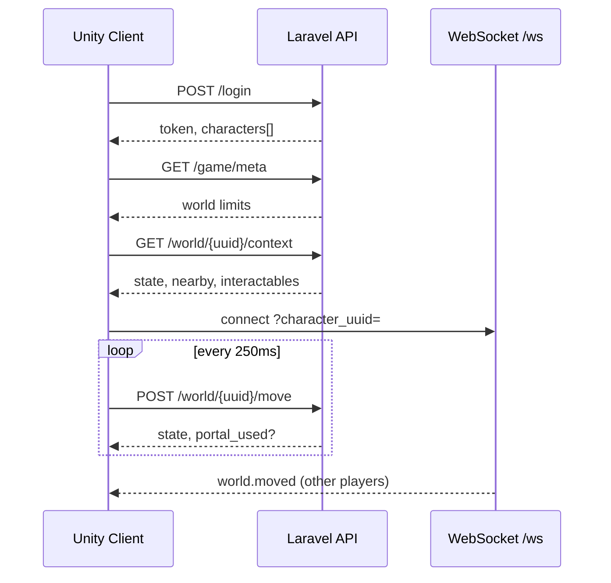

# Unity Client Guide

Sprint 3 bootstrap для 3D-клиента. Серверный контракт — [WORLD_API.md](./WORLD_API.md).

## Расположение

| Путь | Назначение |
|------|------------|
| `clients/unity/` | Unity-проект |
| `content/zones.json` | Data-driven зоны (bounds, NPC, порталы) |
| `GET /api/game/meta` | `world.max_speed`, `max_step`, радиусы |

## Поток входа



## REST

Все запросы с заголовком:

```
Authorization: Bearer {token}
Accept: application/json
```

### Meta (без auth)

```http
GET /api/game/meta
```

```json
{
  "world": {
    "max_speed": 15,
    "max_step": 12,
    "step_size": 3,
    "interact_radius": 5,
    "portal_radius": 4,
    "nearby_radius": 30
  }
}
```

Клиент **обязан** соблюдать `max_step` между последней подтверждённой сервером позицией и следующим `move`. При 422 «Слишком быстрое перемещение» — snap к `state` с последнего успешного ответа.

### Context при входе в зону

```http
GET /api/world/{characterUuid}/context
```

Используйте для начальной расстановки локального игрока, remote avatars и маркеров interactables.

### Move sync

```http
POST /api/world/{characterUuid}/move
{"x": 1.5, "y": 0, "z": 2.0, "rotation_y": 90}
```

Если `portal_used` не null — перезагрузите зону (`GET /zones`, найти `zone.slug == state.zone_slug`).

### Interact

```http
POST /api/world/{characterUuid}/interact
{"target_id": "auction_npc"}
```

Ответ `{ "action": "open_window", "window": "auction" }` — в Sprint 3 логируется; позже открывает UI-панель.

## WebSocket

```text
ws://local.game.local/ws?character_uuid={uuid}&last_event_id=0
```

События для других игроков в той же зоне:

| type | payload |
|------|---------|
| `world.moved` | character_uuid, x, y, z, rotation_y, zone_slug |
| `world.entered_zone` | character_uuid, zone_slug, previous_zone, x, y, z |

Игнорируйте события с `character_uuid == local`.

## Зоны (контент)

`craft_city` — стартовый город:

- Аукционист `(10, -5)` → `auction`
- Верстак `(-8, 3)` → `craft`
- Почта `(5, 8)` → `mail`
- Портал `(0, 48)` → `forest_edge`

`forest_edge`:

- Encounter `forest_rats` → `encounter`
- Портал `(0, 38)` → `craft_city`

## Тестирование

1. PHPUnit: `WorldServiceTest`, `WorldApiTest`
2. Smoke: `scripts/api_bot_smoke_test.py` — portal roundtrip
3. Unity: два клиента, один аккаунт + второй бот — remote avatars через WS

## Hosts

Для локальной разработки добавьте в `/etc/hosts`:

```
127.0.0.1 local.game.local
```

Unity `GameApiConfig.baseUrl` = `http://local.game.local`.

## Ограничения Sprint 3 bootstrap

- Login/HUD на IMGUI (временно)
- Зона — Plane + Cubes/Cylinders
- WebGL не поддерживается (нужен polling вместо WS)
- UI-окна (auction/craft/mail) не встроены — только API interact
